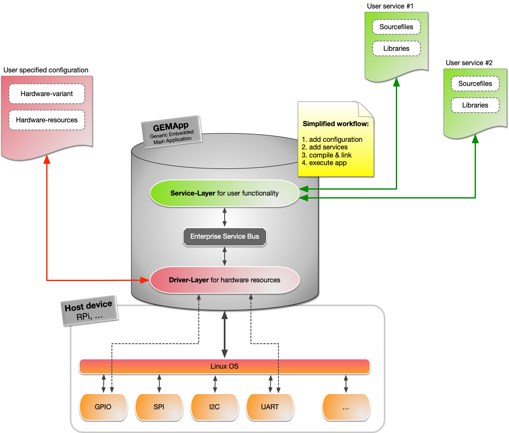
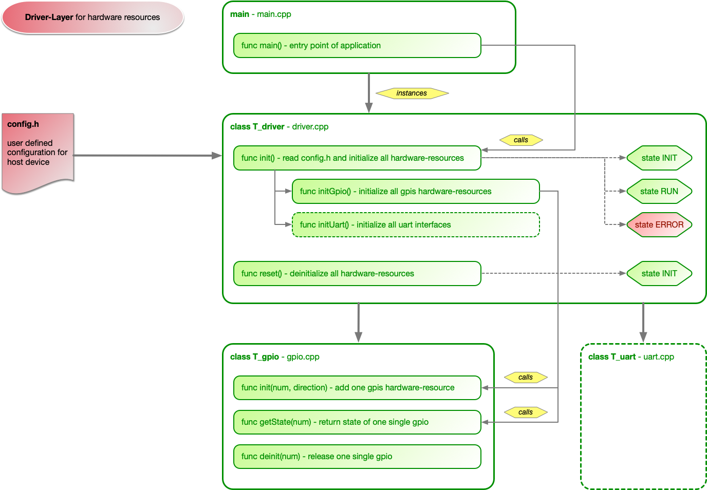
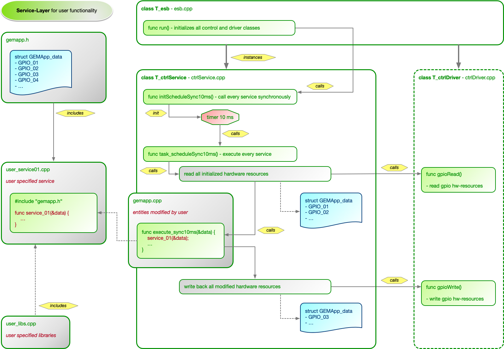

# GEMApp #

The **Generic Embedded Main Application** is kind of a basic software for embedded boards like the Raspberry Pi, BeagleBone, etc written in C++. The goal is to decouple the part of initializing the hardware-ressources and cyclic call of the application code to let you focus on the real functionality.

Therefore you only have to prepare the config.h, add your source files (C++) to the 'userSerices'-directory and register them in the 'gemapp.cpp'. Please follow the detailed description in the HowTo-section.

## Supported hardware ##

Devices:

- Raspberry Pi 4 _(other devices not tested at the moment but it should be working on most RPi's)_

Hardware-ressources:

- GPIOs _(at the moment only following numbers: 05, 06, 12, 13, 26 - will be completed soon)_

## HowTo ##

### Clone repository ###

```bash
git clone https://github.com/green-rab/GEMApp.git
```

### Edit configuration ###

Open 'include/config.h' and edit the #define's:

```cpp
#define CONFIG_GPIO_05 INPUT
#define CONFIG_GPIO_06 INPUT
#define CONFIG_GPIO_12 OUTPUT
#define CONFIG_GPIO_13 UNUSED
#define CONFIG_GPIO_26 UNUSED
```

Every GPIO can have following modes:

- INPUT
- OUTPUT
- UNUSED

At the moment no more GPIOs and other hardware-ressources are available.

### Include types to your code ###

Add 'include/gemapp.h' to your code. It specifies a type that is handed over by reference and includes the actual read hardware-inputs:

```cpp
struct t_GEMApp_data {
    bool GPIO_05;
    bool GPIO_06;
    bool GPIO_12;
    bool GPIO_13;
    bool GPIO_26;
};
```

In your code you have to directly manipulate the hardware-outputs that are then automatically written by GEMApp.

### Integrate your source-files ###

Copy your files to the folder 'userServices'. You can have a look at the files 'dummy_service' for an example.

Open 'source/gemapp.cpp' and declare your header-files:

```cpp
#include "../userServices/dummy_service.h"
```

If needed you can specify local variables (dummy_service is used as a class):

```cpp
T_dummy_service *dummy_service;
```

Then at the moment you can only choose a cyclic execution with a cycle of 10 ms. At the execution routine of your class or the function that has to be called in the following section:

```cpp
void execute_sync10ms(t_GEMApp_data &data) {
    dummy_service->execute(data);
}
```

Please add your used hardware-ressources in the startup-section. Optionally you can add something for your code at startup and shutdown e.g. initialization of your class:

```cpp
void execute_sync10ms_startup() {
    dummy_service = new T_dummy_service();

    execute_sync10ms_INPUTS.push_back(GPIO_05);
    execute_sync10ms_INPUTS.push_back(GPIO_06);
    execute_sync10ms_INPUTS.push_back(GPIO_13);
    execute_sync10ms_INPUTS.push_back(GPIO_26);

    execute_sync10ms_OUTPUTS.push_back(GPIO_12);
}

void execute_sync10ms_shutdown() {
    if(dummy_service) {
        delete dummy_service;
    }
    dummy_service = nullptr;
}
```

### Compile and execute ###

For compiling please do:

```bash
make rpi
```

The 'rpi' is very important without you are in a debug-session and build will fail, because it cannot find CppUTest-project.

If compiling is successful you can run your application:

```bash
bin/rpi/gemapp
```

## Look inside ##

The application consists of three main parts:

- Enterprise Service Bus (ESB) -> source/esb.cpp
- Driver-Layer for hardware-ressources -> source/ctrlDriver.cpp
- Service-Layer for user-functionality -> source/ctrlService.cpp

The ESB is the main sheduler that initializes both abstraction layers. First the driver-layer is intialized with the user specified configuration for selection of device and its hardware-ressources (config.h). Secondally the ESB initializes the service-layer where user functions or classes are added and sheduled cyclically.

Please note that all pictures are simplified and not fully detailed



### Driver-Layer ###

The driver-layer is called by the ESB and initializes the whole hardware-ressources. Therefore it exists only one init-function that is called. The desired configuration is read from the config.h and internally interpreted and checked. If there is an invalid configuration the init-function returns an error.

For all types of ressources (GPIO, SPI, ...) are single init-functions called. They call the single driver-classes for every single ressource, like drvGpio.cpp for all GPIOs. All classes are instanced by the ESB and called by its pointer.



### Service-Layer ###

The service-layer is called by the ESB, too. It is called after all hardware-ressources are successfully initialized by the driver layer and shedules the user-functions. Therefor it initializes an asynchronous timer with an interval of 10 ms that is called cyclically.

In the function task_scheduleSync10ms there are three steps every cyclic call:

1. Read all input values (e.g. GPIOs). The values are not read direct, it uses the interface of the driver-layer and stores all values in struct with name 'data'
2. Call function execute_sync10ms(..) with the input data. The function has to be prepared by the user and calls directly user-specific functions or classes with 'data' as input parameters
3. Write back the returned 'data' values. Therefore the driver-layer is used again to set the new output values (e.g. GPIOs)

Theses steps will be executed every 10 ms. It is planned to append more constant delayed shedulers, 10 ms is only the first goal.



## Version history ##

| Version | Date | Description |
| --- | --- | --- |
| 0.1     | 22.01.2021 | basic gpio, tested for RPi 4 |
