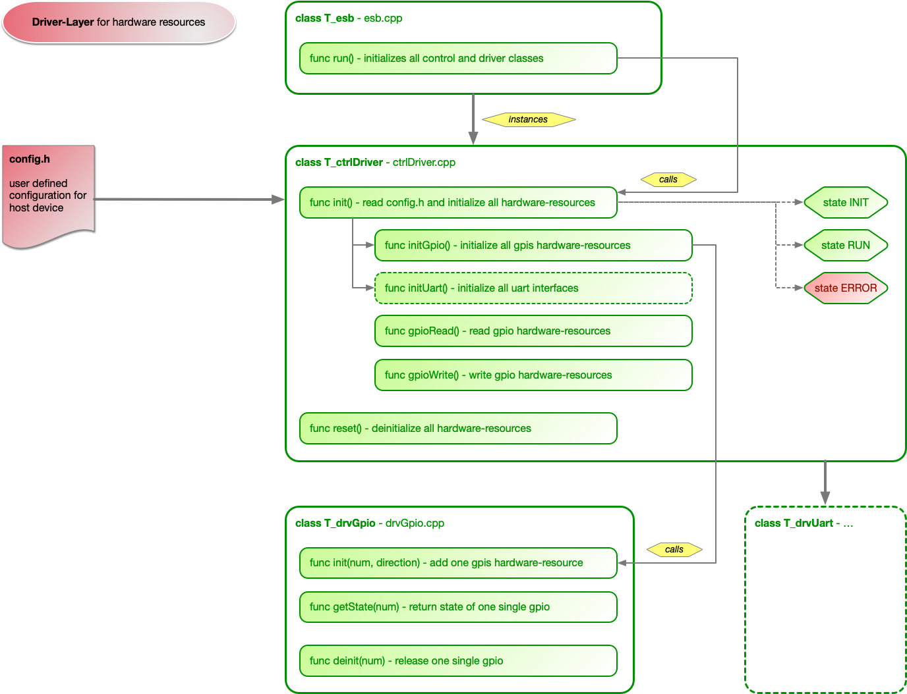

# GEMApp #

[[Overview](#overview)] [[HowTo - use GEMApp for your own project](#howto)] [[Look inside](#lookInside)]

The **Generic Embedded Main Application** is kind of a basic software written in C++ for embedded boards like the Raspberry Pi. The goal is to decouple the part of initializing hardware-resources from the application code to let you focus on the implementation of functionality.


<a name="overview"></a>
## Overview ##

Remarks:
- Please keep in mind it is a first **DEBUG** demo version with very limited functionality.

Version history:

<table>
	<tr>
		<th align="center">Version</th>
		<th align="left">New features</th>
		<th align="left">Resolved bugs</th>
	</tr>
	<tr></tr>
	<tr>
		<td align="center" valign="top">v0.1</td>
		<td align="left" valign="top">first version with limited hardware-resources<br>GPIOs supported: 05, 06, 12, 13, 26</td>
		<td align="left" valign="top">-</td>
	</tr>
</table>

Supported devices:

- Raspberry Pi 4 _(other devices are not tested at the moment but it should be working on several RPi's)_

Supported hardware-resources:

- GPIOs _(only following numbers: 05, 06, 12, 13, 26)_

Open points:

- Complete initialization for all gpios
- Add communication interfaces

<a name="howto"></a>
## HowTo - use GEMApp for your own project ##

Checkout or clone the repository. You have to edit:
- config.h
- gemapp.cpp

Add to your code:
- gemapp.h

Place your source files into the folder 'userServices'

That's it! ..I have tried to keep it as simple as possible 

### Edit config.h ###

Open 'include/config.h' and choose your desired configuration for the hardware-resources. Therefore you have to edit the #define statements, choose the keywords INPUT, OUTPUT or UNUSED for every line.

```cpp
#define CONFIG_GPIO_05 INPUT
#define CONFIG_GPIO_06 INPUT
#define CONFIG_GPIO_12 OUTPUT
#define CONFIG_GPIO_13 UNUSED
#define CONFIG_GPIO_26 UNUSED
```

### Include gemapp.h for the data type to your code ###

Add 'include/gemapp.h' to your code. It specifies a type that is handed over by reference and includes the actual read hardware-inputs. By writing to the reference you can write to the hardware-outputs that are handled after your code has finished.

```cpp
struct t_GEMApp_data {
    bool GPIO_05;
    bool GPIO_06;
    bool GPIO_12;
    bool GPIO_13;
    bool GPIO_26;
};
```


### Copy to folder ###

Copy your source files to the folder 'userServices'. You can have a look to the files dummy_service.cpp and dummy_service.h as an example.

### Edit gemapp.cpp ###

Open 'source/gemapp.cpp' and declare your header-files:

```cpp
#include "../userServices/dummy_service.h"
```

If needed you can specify local variables (dummy_service is used as a class):

```cpp
T_dummy_service *dummy_service;
```

At the moment you can only choose a cyclic execution with a cycle time of 10 ms. Add the execution routine of your class or your function that has to be called in the following section:

```cpp
void execute_sync10ms(t_GEMApp_data &data) {
    dummy_service->execute(data);
}
```

Please add your used hardware-resources in the startup-section. Optionally you can add something for your code at startup and shutdown e.g. initialization of your class:

```cpp
void execute_sync10ms_startup() {
    dummy_service = new T_dummy_service();

    execute_sync10ms_INPUTS.push_back(GPIO_05);
    execute_sync10ms_INPUTS.push_back(GPIO_06);
    execute_sync10ms_INPUTS.push_back(GPIO_13);
    execute_sync10ms_INPUTS.push_back(GPIO_26);

    execute_sync10ms_OUTPUTS.push_back(GPIO_12);
}

void execute_sync10ms_shutdown() {
    if(dummy_service) {
        delete dummy_service;
    }
    dummy_service = nullptr;
}
```

### Compile and execute ###

For compiling please call make with parameter 'rpi'. _(without 'rpi' you are in a debug-session and build will fail)_

```bash
make rpi
```

If compile is successful done you can run your application:

```bash
bin/rpi/gemapp
```

<a name="lookInside"></a>
## Look inside ##

The application consists of three main parts:

- Enterprise Service Bus (ESB) _(source/esb.cpp)_
- Driver-Layer for hardware-resources _(source/ctrlDriver.cpp)_
- Service-Layer for user functionality _(source/ctrlService.cpp)_

The ESB is the main sheduler that initializes both abstraction layers, driver for hardware-resources and service for handling user application code.

_(Please note that all pictures are simplified and not fully detailed)_

### Driver-Layer ###

The driver-layer initializes the whole hardware-resources. Therefore only one init function has to be called. The desired configuration is read from the **config.h** and internally checked and interpreted. An invalid configuration throws back an error.

For all types of resources (GPIO, SPI, ...) drives are implemented. All drivers are initialized by the ESB, too.



### Service-Layer ###

The service-layer is called after all hardware-resources are successfully initialized. It shedules the user functionality. Therefor it initializes an asynchronous timer with an interval of 10 ms that is called periodically.

In the function 'task_scheduleSync10ms' there are three steps every cyclic call:

1. Read all input values (e.g. GPIOs). The values are not read direct, it uses the interface of the driver-layer and stores all values in a struct with the name 'data'
2. Call function execute_sync10ms(..) with the input data. The function has to be prepared by the user and calls directly user-specific functions or classes with 'data' as input parameter
3. Write back the returned 'data' values. Therefore the driver-layer is used again to set the new output values (e.g. GPIOs)

